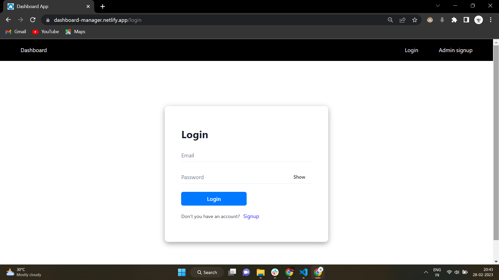
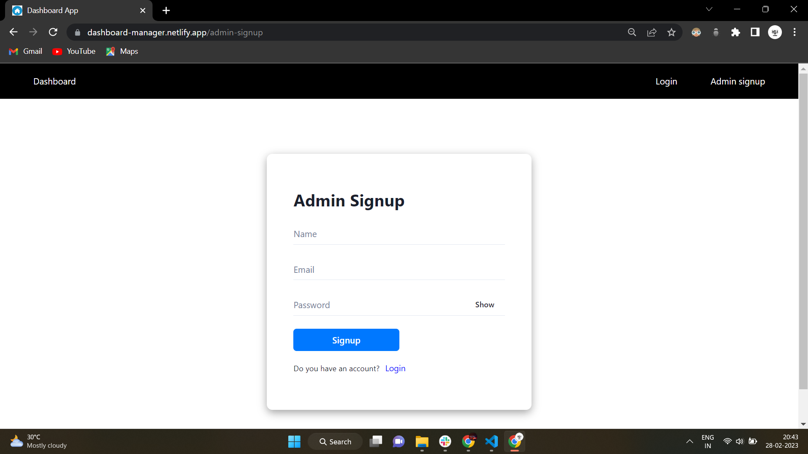
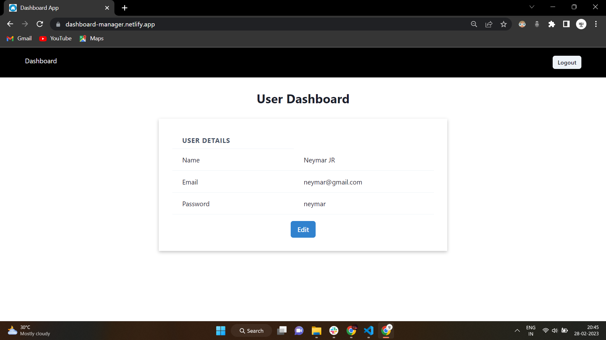
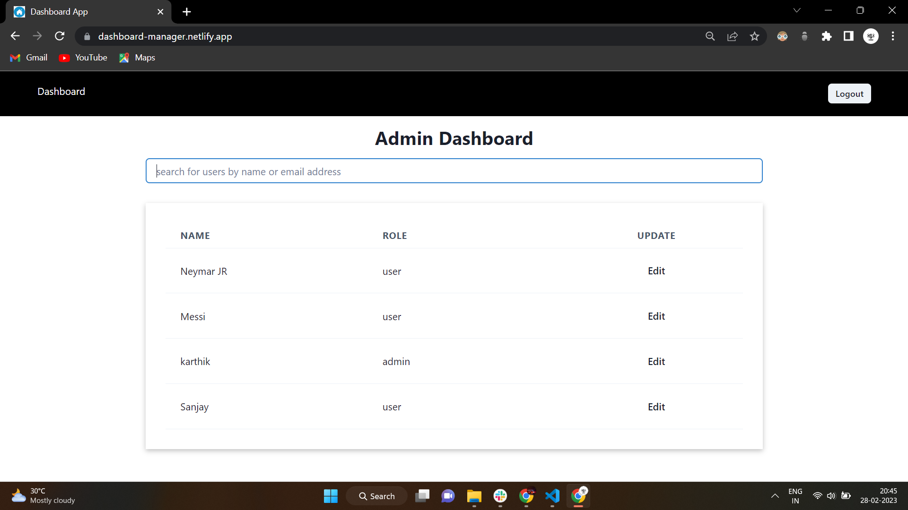

# Dashboard Manager

This project is a simple web application built using the MERN stack (MongoDB, Express, React, Node.js) with user authentication and authorization. The application allows users to sign up, log in, and view their own information. Admins have additional access to an admin dashboard where they can view all users and their roles.

 

## Installation

1, Clone the repository

2, Navigate to the server directory in the terminal/command prompt

3, Run npm install to install dependencies for the backend server

4, Navigate to the client directory by running cd client

5, Run npm install to install dependencies for the client-side application

6, Navigate back to the project directory by running cd ..

 

## Usage

• To start the server, navigate to the server directory in the terminal/command prompt and run the command npm run server. Before running the server, you'll need to create a .env file in the root folder of the project and add the following environment variables:

- PORT: The port number that the server should listen on.

- MONGO_URL: The URL of the MongoDB database that the server should connect to.

- JWT_CLIENT_SECRET: A secret key that the server will use to sign and verify JSON Web Tokens (JWTs).

 

• To start the client application, go to the "client" directory and run the command "npm run dev". Also, make sure to update the "API_URL" in the "config.js" file located in the "src" folder with the URL where our backend server is running. This will ensure that the client can communicate with the server correctly.

• Navigate to http://127.0.0.1:5173/ in your browser to use the application

 

## Features

• User authentication using JWT

• User sign-up page with server-side validation

• User login page with server-side validation

• User dashboard where users can view and update their own information

• Admin dashboard where admins can view all users and their roles, search for users by name or email address, and update user roles

• Role-based authorization using JWT

 

## Technologies

• MongoDB

• Express

• React

• Node.js

• Redux

 
 

### the login page allows both normal users and admin users to log in to the system.

 
 

### On the right-hand side of the navigation bar, there is a admin-signup button that allows users to create an admin ID. Clicking on this button will redirect the user to a page where they can sign up as an admin.

 
 

### Once a normal user has successfully logged in or signed up, they will be redirected to this page. On this page, the user has the ability to update their name, email, and password.

 
 

### If the logged-in user is an admin, they can access a page that displays a list of all users in the system along with their roles. The admin can also change the roles of users and search for users based on their name or email.
